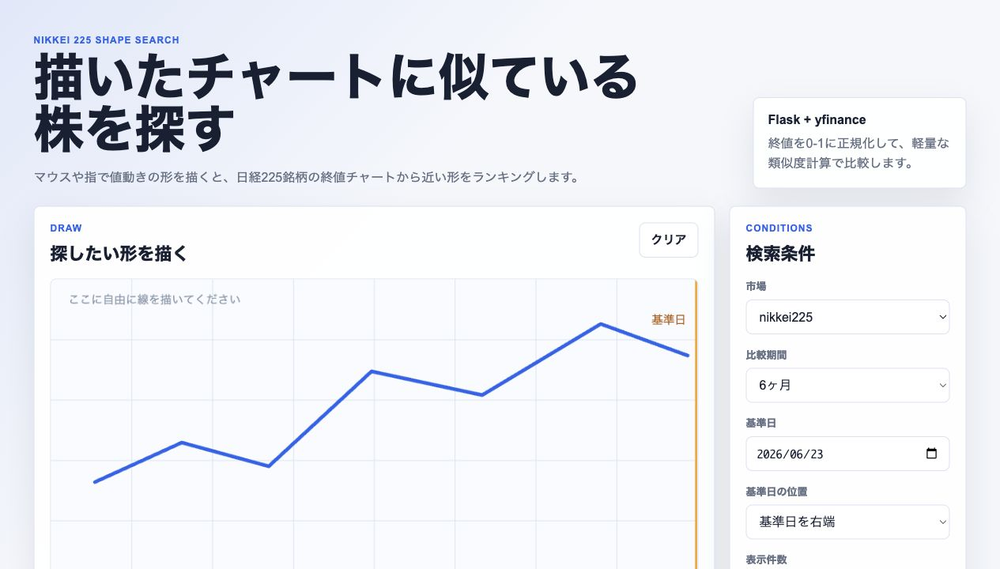

# Chart Shape Finder

手描きしたチャート形状に近い値動きをした日本株を探す、Flask製の株価チャート類似検索アプリです。

Canvas に描いた線と日経225銘柄の終値チャートを同じ点数にリサンプリングし、正規化したうえで類似度を計算します。複雑な機械学習ではなく、説明しやすい軽量な時系列比較として実装しました。



## What This App Does

- マウスまたは指で、探したいチャート形状を自由に描ける
- 日経225銘柄の終値データから、描いた形に近い銘柄をランキング表示する
- 比較期間を `1ヶ月 / 3ヶ月 / 6ヶ月 / 1年 / 3年 / 5年` から選べる
- 基準日の位置を `左端 / 中央 / 右端` から選べる
- 平均出来高フィルターで流動性の低い銘柄を除外できる
- 描いた線と株価チャートを重ね合わせて、結果を視覚的に確認できる
- 公開デモでは応答性を優先し、`MAX_SYMBOLS` で検索対象数を調整できる

## Why I Built It

株価検索は「銘柄名」や「指標」で探すものが多いですが、このアプリでは「こういう形のチャートを探したい」という直感的な操作を入口にしました。

ポートフォリオとしては、次の要素をまとめて見せられるようにしています。

- ブラウザ上での Canvas UI 実装
- Flask による画面表示と API 実装
- `yfinance` を使った外部データ取得
- pandas / numpy による時系列データ処理
- 類似度スコアリングの設計
- Render などへのデプロイを想定した構成

## Tech Stack

| Area | Tools |
| --- | --- |
| Backend | Python, Flask |
| Data Processing | pandas, numpy |
| Market Data | yfinance |
| Frontend | HTML, CSS, JavaScript, Canvas API |
| Deployment | Gunicorn, Render-ready `Procfile` |

## How It Works

1. Canvas で描かれた線から Y 座標の系列を取り出す
2. 手描き線と株価終値を同じ点数にリサンプリングする
3. どちらの系列も `0-1` の範囲に正規化する
4. 平均二乗誤差から `0-100%` の類似率に変換する
5. 類似率の高い順にランキングし、描画線と株価線を重ねて表示する

この方法にした理由は、処理が軽く、コードの意図を説明しやすく、UI操作から検索結果までの流れが見えやすいからです。

## Design Notes

- 銘柄リストは `data/nikkei225.csv` に固定し、デモ時の安定性を優先
- デフォルトでは代表80銘柄を検索し、`MAX_SYMBOLS=0` でCSV全件検索に切り替え可能
- 同じ市場・期間・基準日の株価データは30分だけメモリキャッシュ
- 基準日が休場日の場合は、取得できる直前の取引日に丸める
- 未来の日付は検索時にエラーとして扱う
- データが不足する銘柄は検索対象から外す

## Project Structure

```text
.
├── app/
│   ├── market_data.py    # 銘柄CSV読み込み、yfinance取得、キャッシュ
│   ├── routes.py         # 画面表示と検索API
│   └── similarity.py     # リサンプリング、正規化、類似度計算
├── data/
│   └── nikkei225.csv     # 検索対象銘柄
├── docs/
│   └── screenshot.png
├── static/
│   ├── app.js            # Canvas操作、API呼び出し、結果描画
│   └── styles.css
├── templates/
│   └── index.html
├── Procfile
├── requirements.txt
└── run.py
```

## Local Development

```bash
python3 -m venv .venv
source .venv/bin/activate
pip install -r requirements.txt
python run.py
```

Then open:

```text
http://localhost:5000
```

## Deployment

Render の Web Service で公開できます。

```text
Build Command: pip install -r requirements.txt
Start Command: gunicorn run:app --bind 0.0.0.0:$PORT --timeout 180
```

このリポジトリには `render.yaml` も入れているため、Render の Blueprint として作成することもできます。

手動で作成する場合:

1. Render Dashboard で `New` → `Web Service`
2. GitHub リポジトリを接続
3. Repository: `mkamuran/temp`
4. Branch: `main`
5. Runtime: `Python`
6. Build Command: `pip install -r requirements.txt`
7. Start Command: `gunicorn run:app --bind 0.0.0.0:$PORT --timeout 180`
8. Instance Type: `Free`
9. `Create Web Service`

無料枠では初回アクセスや初回検索が遅くなることがあります。検索時は `yfinance` で株価を取得するため、外部APIの応答状況によっても待ち時間が変わります。

## Notes

- このアプリはポートフォリオ用のデモアプリです。
- 株式投資の助言や売買推奨を目的としたものではありません。
- 銘柄リストは固定CSVのため、実際の指数構成銘柄と差が出る可能性があります。
